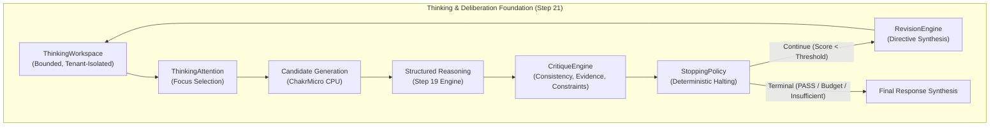

# ChakrView Step 21 — Neural Thinking & Deliberation Architecture

## 1. Executive Summary & Epistemic Boundary

> [!IMPORTANT]
> **Statement on Epistemic Honesty:**
> Step 21 establishes a computational deliberation mechanism; it does not claim consciousness or human-like thought.
> ChakrView deliberation is an inspectable, bounded, deterministic neuro-symbolic runtime coordination loop designed to formulate, evaluate, critique, revise, and verify candidate inferences before finalizing answers.

The objective of Step 21 is to add a genuine, inspectable "Thinking / Deliberation Layer" to the sovereign ChakrView cognitive platform. Prior steps developed the frozen 3.44M parameter neural core (`ChakrMicro v0.1`, Step 3), sovereign capability abstraction (`CapabilityGate`, Step 17), cognitive state management (`CognitiveStateManager`, Step 18), governed structured reasoning (`GovernedReasoningEngine`, Step 19), and the neural reasoning integration loop (`NeuralIntelligenceLoop`, Step 20).

Step 21 elevates these foundations from single-pass inference and isolated reasoning calls into an iterative, multi-cycle **Deliberation Loop**:
```
USER PROMPT
     ↓
Cognitive State (Step 18)
     ↓
Context Construction (Step 20)
     ↓
ChakrMicro Neural Core (Step 3, Frozen)
     ↓
THINKING / DELIBERATION WORKSPACE (Step 21)
├── ThinkingAttention (Priority Selection)
├── ThoughtSteps (Typed, Immutable Sequence)
├── Hypotheses & Evidence Store
├── Structured Reasoning Pass (Step 19)
├── CritiqueEngine (Multi-Criteria Evaluation)
└── RevisionEngine (Feedback-Directed Rethinking)
     ↓
ThinkingStoppingPolicy (Deterministic Termination)
     ↓
Final Response Synthesis (Safe Public Summary)
     ↓
Feedback & Learning Pipeline (Step 20)
```

---

## 2. Core Architectural Principles

Step 21 establishes an explicit conceptual separation across four distinct layers:

1. **Neural Generation:** What `ChakrMicro` predicts autoregressively on CPU given a bounded prompt and context.
2. **Reasoning:** What the structured reasoning engine (`GovernedReasoningEngine`) can formally decompose, deduce, compute, and verify.
3. **Thinking / Deliberation:** The iterative process that decides what to consider next, which hypothesis deserves attention, whether more evidence is required, whether the current candidate is weak or contradicted, whether to revise, and when to stop thinking.
4. **Final Response:** The sanitized, safe user-facing answer. Private intermediate deliberation traces are never exposed verbatim to public APIs.



---

## 3. Deliberation Workspace & Thought Representation

### 3.1 ThinkingWorkspace
The `ThinkingWorkspace` is a bounded, isolated, serializable working state structure that maintains:
- `objective`: Cleaned target objective.
- `thought_steps`: Ordered sequence of immutable `ThoughtStep` objects.
- `hypotheses`: Active candidate solutions and propositions with confidence tags.
- `evidence`: Verified premise and capability observations.
- `unresolved_questions`: Explicit open epistemic gaps.
- `weaknesses`: Identified deficiencies and flaws.
- `critiques`: Historical critique evaluation outcomes.
- `revisions`: Preserved revision plans and directives.
- `stopping_state`: Terminal condition record.

#### Enforced Resource Bounds
Uncontrolled thought generation is strictly prevented by hard policy ceilings:
- `max_thought_steps`: Default 10 (Strict: 6, Fast: 3).
- `max_hypotheses`: Default 5.
- `max_revision_cycles`: Default 2.
- `max_evidence_items`: Default 12.
- `max_workspace_tokens`: Default 512.
- `max_deliberation_time_ms`: Default 2500.0 ms.

### 3.2 ThoughtStep Representation
A `ThoughtStep` is a strongly typed, immutable dataclass (`frozen=True`) preventing historical tampering:
- `thought_id`: Unique identifier (`th_...`).
- `step_index`: 1-based sequential index.
- `purpose`: Enumerated cognitive intent (`ThoughtPurpose`).
- `content`: Descriptive record of the step.
- `input_references`: Prior thoughts or premises consumed.
- `hypothesis_reference`: Hypothesis linked to this step.
- `evidence_references`: Evidence IDs supporting or examined.
- `candidate_action`: Proposed action or method.
- `result`: Computation or verification result.
- `uncertainty`: Heuristic or calibrated uncertainty.
- `confidence_available`: Boolean indicating whether confidence is formal or heuristic.
- `verification_state`: Current verification status (`INITIALIZED`, `PASS`, `FAIL`, etc.).
- `provenance`: Originating component metadata.
- `timestamp`: Epoch creation time.

#### Supported Thought Purposes
`OBSERVE`, `INTERPRET`, `QUESTION`, `HYPOTHESIZE`, `COMPARE`, `INFER`, `PLAN`, `CRITIQUE`, `VERIFY`, `REVISE`, `DECIDE`, `STOP`.

---

## 4. Subsystem Components

### 4.1 ThinkingAttention (Prioritization)
Decides what working state element deserves cognitive attention next using transparent, auditable heuristics:
1. **Unresolved Contradictions:** Highest priority; active conflicts must be investigated immediately.
2. **Detected Weaknesses:** Deficiencies highlighted by critique.
3. **Missing Evidence / Unresolved Questions:** Information gaps preventing conclusion.
4. **Working Hypotheses:** Evaluation and refinement of active candidates.
5. **Objective Orientation:** Fallback when initiating deliberation.

All scores and focus rationales produced by `ThinkingAttention` are explicitly flagged with `is_heuristic=True` to maintain scientific integrity.

### 4.2 CritiqueEngine
Evaluates candidate solutions against explicit structured criteria:
- **Objective Alignment:** Lexical and semantic relevance to the primary prompt, with specialized recognition for mathematical/numerical solutions.
- **Contradiction Detection:** Checks against evidence negation and active uncertainty contradictions.
- **Evidence Grounding:** Flags ungrounded assertions lacking supporting evidence or hypotheses.
- **Constraint Compliance:** Verifies that execution errors or permission failures are penalized.

**Verdicts:**
- `CritiqueVerdict.PASS`: Satisfies all quality and constraint criteria.
- `CritiqueVerdict.WEAK`: Score below policy threshold (`min_critique_score`).
- `CritiqueVerdict.CONTRADICTED`: Conflicting premises or evidence detected.
- `CritiqueVerdict.INSUFFICIENT_EVIDENCE`: Required premise evidence missing.
- `CritiqueVerdict.REQUIRES_REVISION`: Specific operational flaw identified.

### 4.3 RevisionEngine
When candidate solutions fail critique or verification, `RevisionEngine` plans a non-destructive revision cycle:
- Synthesizes a structured `[DELIBERATION_REVISION_DIRECTIVE]` specifying focus areas (`resolve_contradiction`, `gather_evidence`, `correct_weakness`, `refine_clarity`).
- Preserves historical thoughts and previous conclusions without silent mutation.
- Feeds the corrective directive into the subsequent context construction pass for `ChakrMicro`.
- Strictly respects `max_revision_cycles` to guarantee mathematical termination.

### 4.4 ThinkingStoppingPolicy
Determines deterministically when enough deliberation has occurred:
- `SOLVED`: Formal verification passed and critique score meets or exceeds threshold.
- `SOLVED_WITH_UNCERTAINTY`: Adequate conclusion reached, but with acknowledged residual uncertainty.
- `INSUFFICIENT_INFORMATION`: Essential premises are missing and cannot be derived from local state.
- `MAX_REASONING_LIMIT`: Step count or timeout budget ceiling reached.
- `MAX_REVISIONS_REACHED`: Maximum allowed revision cycles exhausted without full verification pass.
- `REQUIRES_EXTERNAL_INPUT`: Execution requires user intervention or external sensor observation.
- `FAILED_VERIFICATION`: Explicit structural invariant violation.

---

## 5. Security & Isolation Boundaries

Step 21 strictly upholds all sovereign security invariants established in Steps 15–20:

1. **Axiomatic Authority Boundary:**
   $$\text{DATA} \neq \text{AUTHORITY}$$
   $$\text{REASONING} \neq \text{AUTHORITY}$$
   $$\text{THINKING} \neq \text{AUTHORITY}$$
   $$\text{MEMORY} \neq \text{AUTHORITY}$$
   $$\text{NEURAL OUTPUT} \neq \text{AUTHORITY}$$

2. **Capability Access Protection:**
   Thinking can NEVER authorize capability execution directly. All capability invocations inside deliberation route through `CapabilityGate.authorize()` with explicit permissions checked against user/session security context.

3. **Multi-Tenant Isolation:**
   Workspaces are partitioned strictly by `(owner_id, session_id)`. Any attempt to cross-pollinate thoughts or evidence across tenant boundaries raises `TenantIsolationError`.

4. **Private Reasoning Trace Shielding:**
   Intermediate thoughts are never exposed verbatim through external response channels. The public API receives either the verified synthesized conclusion or a safe, high-level structured summary (`ThinkingTrace.get_safe_summary()`).

---

## 6. Frozen Neural Core Invariants

The `ChakrMicro v0.1` neural core remains 100% frozen:
- **Total Parameters:** Exactly `3,443,136` (zero parameters added or removed).
- **Vocabulary Size:** Exactly `4,096`.
- **Context Length:** Exactly `512`.
- **Special Token IDs:** `BOS=0, EOS=1, PAD=2`.
- **Weight Immutability:** Runtime inference uses `torch.no_grad()` and is strictly verified by bit-for-bit tensor hash comparison (`weights_modified = False`).

---

## 7. Empirical CPU Benchmark Results

The benchmark suite (`scripts/benchmark_thinking.py`) was executed on the CPU test environment (PyTorch 2.14.0+cpu, 14 threads).

| Metric | Measured Value | Unit / Notes |
| :--- | :--- | :--- |
| **ChakrMicro Parameter Count** | `3,443,136` | Verified exact invariant |
| **Workspace Creation Latency** | `0.0042` | ms (mean) |
| **Thought Step Addition Latency**| `0.0042` | ms (mean per step) |
| **Workspace Serialization Latency**| `0.0498` | ms (mean to JSON) |
| **Attention Selection Latency** | `0.0007` | ms (heuristic focus selection) |
| **Critique Evaluation Latency** | `0.0097` | ms (multi-criteria critique) |
| **Revision Planning Latency** | `0.0044` | ms (directive formulation) |
| **Stopping Evaluation Latency** | `0.0008` | ms (terminal condition check) |
| **Direct Math Query Deliberation**| `60.36` | ms (solved in 5 steps, 0 rev) |
| **Analytical Query Deliberation** | `144.17` | ms (9 steps, 1 revision) |
| **Constrained Decision Query** | `65.62` | ms (solved in 5 steps, 0 rev) |
| **Overall Mean Deliberation Latency**| `90.05` | ms |
| **Overall p95 Deliberation Latency** | `153.11` | ms |
| **Average Thinking Steps** | `6.33` | steps per objective |
| **Average Revision Cycles** | `0.33` | revisions per objective |
| **Average Workspace Memory Footprint**| `5,645.7` | bytes serialized JSON |
| **Runtime Weight Modification** | `False` | Bit-for-bit identical weights |

---

## 8. Failure Modes & Limitations

1. **Vocabulary / Context Bound (512 tokens):**
   The neural candidate continuation prompt must accommodate the task objective, relevant evidence summaries, and revision directives within 512 tokens. Extremely lengthy prompt histories are budgeted and truncated by priority.
2. **Heuristic Attention Scoring:**
   In Step 21, `ThinkingAttention` utilizes deterministic heuristic prioritization rules. While transparent and robust, it does not yet use learned attention dispatch.
3. **CPU Latency Floor:**
   End-to-end deliberation requires ~60–150 ms on CPU due to multi-step autoregressive candidate generation and capability verification passes.
4. **Epistemic Modesty:**
   When evidence is absent or contradictory and cannot be resolved locally, the deliberator halts with `INSUFFICIENT_INFORMATION` rather than hallucinating an answer.

---

## 9. Future Learning Extension Points

The interfaces implemented in Step 21 are explicitly designed for future reinforcement learning and supervised policy tuning (Step 22+):
1. **Hypothesis Utility Modeling:** Training value estimators to predict which candidate hypotheses are likely to survive critique.
2. **Evidence Relevance Scoring:** Learning semantic relevance matrices to select the highest-value evidence for context construction.
3. **Critique Calibration:** Training critique heads to predict verification failure before invoking heavy capability solvers.
4. **Optimal Stopping Policies:** Learning adaptive thresholding for when additional deliberation yields marginal information gain.
