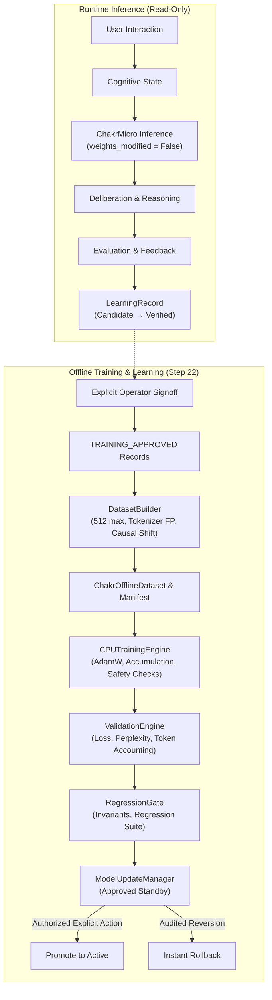

# ChakrView Step 22 — Neural Learning & CPU Training Architecture

## 1. Executive Summary & Epistemic Boundary

> [!IMPORTANT]
> **Statement on Epistemic Honesty:**
> Step 22 establishes the foundational offline neural learning/training layer that transforms verified and training-approved learning records into reproducible training datasets and trains a `ChakrMicro` model on CPU.
> It does NOT claim that ChakrView has acquired new cognitive knowledge or generalized capabilities beyond the specific supervised optimization demonstrated in unit fixtures and empirical benchmarks.

Prior steps established the frozen 3.44M parameter generative core (`ChakrMicro v0.1`, Step 3), sovereign capability gate (`CapabilityGate`, Step 17), cognitive state management (`CognitiveStateManager`, Step 18), governed structured reasoning (`GovernedReasoningEngine`, Step 19), neural integration contracts (`LearningRecord`, `ModelUpdateManager`, Step 20), and neural thinking/deliberation (`DeliberationEngine`, Step 21).

Step 22 bridges runtime experience to offline improvement by establishing the **Offline Neural Learning & Training Pipeline**:
```
Runtime Execution:
    USER PROMPT
         ↓
    COGNITIVE STATE
         ↓
    CONTEXT BUILDER
         ↓
    CHAKRMICRO INFERENCE (Read-Only, Zero Weight Mutation)
         ↓
    DELIBERATION & GOVERNED REASONING
         ↓
    OBSERVATION & EVALUATION
         ↓
    LEARNING RECORD (Candidate → Verified)

Offline Neural Training:
    TRAINING_APPROVED LEARNING RECORDS
         ↓
    DATASET BUILDER (Validation, 512-Ceiling, Tokenization, Split)
         ↓
    CPU TRAINING ENGINE (Shifted Causal LM, AdamW, Grad Accum & Clip, Safety Checks)
         ↓
    VALIDATION ENGINE (Loss, Perplexity, Token Accounting)
         ↓
    REGRESSION GATE (Invariants, Tokenizer Compatibility, Smoke Tests)
         ↓
    MODEL VERSION REGISTRATION (Approved Standby)
         ↓
    EXPLICIT OPERATOR PROMOTION / AUDITED ROLLBACK
```

---

## 2. Core Architectural Separation

The cardinal principle of Step 22 is the strict operational and temporal separation between runtime inference and offline model training:

1. **Runtime Inference is Weight-Immutable:**
   The active `ChakrMicro` model instance running in `NeuralInferenceEngine` or `DeliberationEngine` operates under `torch.no_grad()` and is permanently read-only (`weights_modified = False`). Runtime queries never alter model tensors.
2. **Offline Training Operates on Disjoint Instances:**
   Training occurs in an isolated, offline process on a separate model instance. Newly trained weights are never written in-place to the running model.
3. **No Automatic Model Promotion:**
   Trained checkpoints cannot automatically replace production weights. Promotion requires multi-stage verification (architecture invariants, tokenizer compatibility, validation completion, regression test pass) followed by explicit operator authorization.
4. **Data Authority Separation:**
   $$\text{RAW USER TEXT} \neq \text{VERIFIED TRAINING DATA}$$
   Only records that have undergone verification and explicit administrative signoff (`TRAINING_APPROVED`) may enter the training dataset builder.



---

## 3. Subsystem Components

### 3.1 Training Data Contract (`chakrview/training/contract.py`)
Defines strongly typed training contracts:
- `TrainingExample`: Encapsulates a tokenized, sequence-packed training instance preserving end-to-end provenance:
  - `example_id`: Unique identifier (`tx_...`).
  - `source_record_id`: Originating `LearningRecord` ID.
  - `owner_id`, `session_id`: Tenant ownership boundary.
  - `input_text`, `target_text`: Raw context and target.
  - `sequence_token_ids`: Tokenized full sequence `[BOS] + input_tokens + target_tokens + [EOS]`.
  - `is_truncated`, `truncation_notes`: Explicit audit trail if length exceeds 512 tokens.
  - `tokenizer_fingerprint`: Cryptographic hash of active tokenizer.
- `TrainingDatasetManifest`: Cryptographic summary containing dataset fingerprint, tokenizer fingerprint, total example and token counts, split partitions, and provenance metadata.
- `TokenizerFingerprint`: SHA-256 fingerprint generated from vocabulary size, merge table entries, and special token IDs.
- `validate_learning_record_for_training()`: Fails closed on any record whose status is not `TRAINING_APPROVED`. Rejects `CANDIDATE`, `VERIFIED`, `REJECTED`, and `QUARANTINED`.

### 3.2 Dataset Builder (`chakrview/training/builder.py`)
- `DatasetBuilder`:
  1. Validates records against strict eligibility criteria.
  2. Tokenizes texts with frozen `BPETokenizer`.
  3. Formulates causal language modeling sequences with `BOS=0` prefix and `EOS=1` suffix.
  4. Enforces hard maximum sequence length $\le 512$. Any sequence exceeding 512 tokens is explicitly truncated with metadata logged in `truncation_notes`.
  5. Computes deterministic dataset fingerprint (SHA-256 hash over sorted example tokens).
  6. Generates deterministic train and validation partitions via seeded shuffle.
  7. Supports building directly from in-memory records or from exported JSONL files.
- `ChakrOfflineDataset`:
  - PyTorch `Dataset` producing `input_ids`, shifted `target_ids`, and `attention_mask`.
  - Implements dynamic batch collation `ChakrOfflineDataset.collate_fn` with padding (`PAD_ID=2`).

### 3.3 Offline CPU Training Engine (`chakrview/training/engine.py`)
- `CPUTrainingEngine`:
  - Operates on a dedicated `ChakrMicro` instance on CPU.
  - Verifies frozen model invariants upon initialization (`TrainingSafetyChecker.enforce_model_invariants`).
  - Executes causal next-token optimization using `CausalLoss(ignore_index=2)`.
  - Optimizes with `AdamW` (betas=(0.9, 0.95), weight decay=0.01 excluding 1D biases and layer norms).
  - Supports gradient accumulation (`gradient_accumulation_steps`).
  - Implements gradient clipping (`clip_grad_norm_`).
  - Periodic evaluation on validation split via `ValidationEngine`.
  - Periodic and final atomic checkpoint saving via `CheckpointManager`.
  - Resumption from existing checkpoints with parameter and metadata validation.
  - Emits comprehensive `TrainingRunManifest`.

### 3.4 Training Safety System (`chakrview/training/safety.py`)
Implements strict closed-loop safety invariants:
- `TrainingSafetyChecker`:
  - `verify_model_invariants()`: Validates parameters == 3,443,136, vocab == 4096, context == 512, BOS == 0, EOS == 1, PAD == 2.
  - `verify_token_ids()`: Verifies all token IDs are within $[0, 4095]$.
  - `check_loss()`: Detects NaN, Inf, or exploded loss (> 1000.0) and raises `NumericalInstabilityError`.
  - `check_gradients()`: Detects NaN, Inf, or exploding gradients (> 500.0) and raises `NumericalInstabilityError`.
  - `verify_tokenizer_compatibility()`: Fails closed on tokenizer fingerprint mismatch.
  - `verify_checkpoint_metadata()`: Validates checkpoint structure and unique parameter count (deduplicating tied embeddings) before resume.

### 3.5 Validation Engine (`chakrview/training/validation.py`)
- `ValidationEngine`:
  - Evaluates models in `model.eval()` and `torch.no_grad()` without modifying state.
  - Computes mean cross-entropy loss over unmasked tokens.
  - Computes perplexity $\text{PPL} = \exp(\text{loss})$.
  - Mathematical robustness: If loss is NaN, Inf, or excessively large (> 85.0), sets `perplexity = None`, `perplexity_valid = False`, and emits an honest status note rather than producing overflow or fabricated metrics.

### 3.6 Regression Gate & Promotion Lifecycle (`chakrview/training/regression.py`)
- `RegressionGate`:
  - Governs progression across formal states: `TRAINING` $\to$ `TRAINED` $\to$ `VALIDATED` $\to$ `REGRESSION_TESTED` $\to$ `PROMOTABLE` $\to$ `PROMOTED`.
  - Evaluates 5 gates:
    1. Invariant verification (3,443,136 parameters, 4096 vocab, 512 context).
    2. Tokenizer compatibility (fingerprint equality).
    3. Validation completion (finite loss, valid perplexity).
    4. Checkpoint integrity.
    5. Regression test suite pass (custom test callable or forward smoke check).
  - Automatically registers promotable checkpoints in `ModelUpdateManager` as `APPROVED_STANDBY`.
  - Promotion requires explicit operator invocation (`promote_candidate`).
  - Rollback instantly restores earlier approved model version.

### 3.7 Reproducibility Manifest (`chakrview/training/manifest.py`)
- `TrainingRunManifest`:
  - Captures run ID, seed, model version, parameter count, tokenizer fingerprint, dataset fingerprint, optimizer config, learning rate, batch size, gradient accumulation, total steps, hardware, threads, framework version, checkpoint paths, and final metrics.
  - Computes cryptographic `reproducibility_hash`.

---

## 4. Empirical CPU Benchmark Results

Benchmarks were executed on CPU (Intel 14 threads, PyTorch 2.14.0+cpu) via `scripts/benchmark_training.py`.

| Component / Metric | Measured Performance | Notes |
| :--- | :--- | :--- |
| **ChakrMicro Parameter Count** | `3,443,136` | Verified exact invariant |
| **Dataset Compilation Latency** | `52.06 ms` | Mean for 50 records |
| **Tokenization Throughput** | `60,504.71 tok/s` | Byte-level BPE on CPU |
| **DataLoader Throughput** | `8,026.84 batches/s` | Batch size = 4 |
| **DataLoader Token Rate** | `2,237,241.34 tok/s` | Dynamic collation & padding |
| **Forward Pass Latency (B=2, T=64)**| `10.12 ms` | `12,653.44 tok/s` |
| **Backward Pass Latency (B=2, T=64)**| `14.14 ms` | `9,052.30 tok/s` |
| **AdamW Optimizer Step** | `6.18 ms` | All 3,443,136 parameters updated |
| **Atomic Checkpoint Save** | `11.63 ms` | Complete state dict + optimizer (13.16 MB) |
| **End-to-End Training (5 steps)** | `440.06 ms` | `88.01 ms/step` |
| **Training Throughput** | `1,408.90 tok/s` | Forward + backward + optimizer + accumulation |
| **Runtime Weight Modification** | `False` | Inference model verified untouched |

---

## 5. Security & Isolation Boundaries

1. **Axiomatic Authority Principles:**
   $$\text{DATA} \neq \text{AUTHORITY}$$
   $$\text{REASONING} \neq \text{AUTHORITY}$$
   $$\text{RAW USER TEXT} \neq \text{VERIFIED TRAINING DATA}$$
2. **Multi-Tenant Dataset Isolation:**
   `LearningPipeline` strictly enforces tenant boundaries. Tenant A cannot approve, inspect, or export Tenant B's learning records.
3. **Prompt Injection Quarantine:**
   Records flagged with `QUARANTINED` cannot be verified or approved, preventing adversarial injection payloads from polluting training datasets.
4. **No In-Place Self-Modification:**
   Runtime inference models are permanently read-only. Offline training operates on disjoint model instances.
5. **No Automatic Promotion:**
   Trained checkpoints require explicit operator signoff before replacing the active production model.

---

## 6. Frozen Neural Core Invariants

The `ChakrMicro v0.1` architecture remains 100% frozen:
- **Parameters:** Exactly `3,443,136`.
- **Vocabulary Size:** Exactly `4,096`.
- **Context Length:** Exactly `512`.
- **Special Token IDs:** `BOS=0, EOS=1, PAD=2`.
- **Weights:** Weight tying between input embedding and output LM head is preserved (`lm_head.weight == embedding.weight`).

---

## 7. Status: Implemented vs. Future

### Implemented Now (Step 22)
- Strongly typed training data contracts (`TrainingExample`, `TrainingDatasetManifest`, `TokenizerFingerprint`).
- Deterministic dataset builder with 512-token ceiling and explicit truncation logging.
- Causal next-token prediction sequence formatting with shifted targets.
- Dedicated offline CPU training engine (`CPUTrainingEngine`) around `ChakrMicro`.
- Closed-loop training safety checks (NaN/Inf loss and gradient detection, token ID bounds, invariant verification).
- Robust validation engine with mathematical overflow protection for perplexity.
- Multi-stage regression gate governing model promotion with instant rollback.
- Cryptographically verifiable training run manifests.
- Full unit test suite (25 dedicated Step 22 tests; 588 tests overall).

### Future Training Capability (Step 23+)
- Domain-specific pretraining datasets compiled from multi-tenant knowledge bases.
- Supervised fine-tuning (SFT) on verified deliberation and reasoning traces.
- Value modeling and reward estimators for thinking attention and critique calibration.
- Multi-epoch curriculum training schedules.
