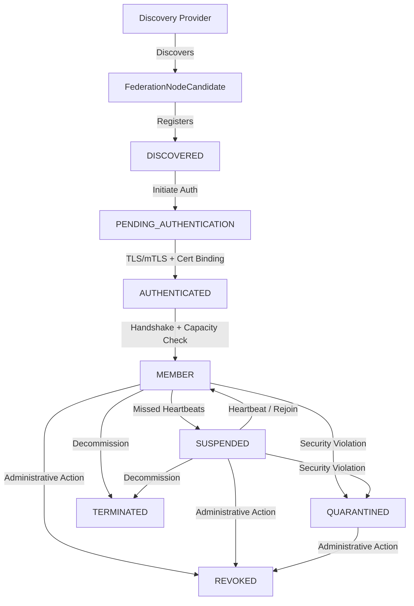

# STEP 35 — PRODUCTION FEDERATION RUNTIME NETWORKING, NODE DISCOVERY & SECURE MEMBERSHIP ARCHITECTURE

## 1. Architectural Overview & Design Axioms

Step 35 transitions ChakrView from an in-memory and durable federation runtime into an active transport-connected federation runtime with explicit node endpoint modeling, controlled discovery, authenticated membership gates, heartbeats, and fail-closed rejoin/quarantine policies.

The core design axioms governing Step 35 are:
1. **Local Authority Dominance**: `LOCAL_AUTHORITY > PEER_AUTHORITY`. Local decisions on admission, suspension, quarantine, and revocation are sovereign and final.
2. **Discovery Decoupling**: `DISCOVERY != TRUST`, `DISCOVERY != AUTHORITY`. Finding an endpoint implies zero authority.
3. **Membership Decoupling**: `MEMBERSHIP != TRUST`, `MEMBERSHIP != AUTHORIZATION`. Enrolling in network topology does not authorize capability execution.
4. **Identity Independence**: `ENGINE_IDENTITY != AUTHORITY`, `NETWORK_REACHABILITY != TRUST`.
5. **Cryptographic Binding**: `TLS_AUTHENTICATION != FEDERATION_AUTHORIZATION`, `mTLS != TRUST_GRANT`. Transport encryption is tied to Ed25519 peer identities.
6. **Partition Tolerance**: `NETWORK_FAILURE != AUTOMATIC_REVOCATION`, `UNREACHABLE != REVOKED`. Temporary partitions suspend nodes; they do not destroy trust.
7. **Local Revocation Primacy**: `LOCAL_REVOCATION > REMOTE_ACTIVE_STATE`.
8. **Neural Core Immutability**: $\Delta W = 0$. Neural model weights remain strictly frozen ($3,443,136$ parameters, SHA-256 hash invariant).



---

## 2. Threat Model Summary & Security Principles

The threat model for Step 35 (detailed in [`STEP_35_THREAT_MODEL.md`](file:///d:/Project/ChakrView/docs/STEP_35_THREAT_MODEL.md)) identifies twenty (20) critical attack vectors spanning candidate spoofing, plaintext downgrade, stolen certificates, candidate flooding, unauthenticated handshake bypass, ambient trust escalation, silent state mutation, Byzantine heartbeats, stale rejoin, divergent state digests, and cross-tenant crossover.

Every mitigation follows the **Fail-Closed Principle**:
- When in doubt, deny access.
- When corrupted, halt recovery.
- When unverified, quarantine or reject.
- Never grant implicit trust from reachability or transport connection.

---

## 3. Strict Axiomatic Boundaries

| Boundary Principle | Architectural Meaning | Implementation Enforcement |
| :--- | :--- | :--- |
| `LOCAL_AUTHORITY > PEER_AUTHORITY` | Remote nodes cannot instruct local nodes to mutate state | Rejection of foreign zone commands |
| `DISCOVERY != TRUST` | Candidate presence grants zero trust | `DISCOVERED` state has no execution rights |
| `MEMBERSHIP != AUTHORIZATION` | Enrolled members must be authorized per invocation | All capabilities guarded by `CapabilityGate` |
| `TLS != FEDERATION_AUTH` | Transport encryption is not trust | `PeerCertificateBinder` verifies identity bindings |
| `UNREACHABLE != REVOKED` | Network partition does not revoke trust | Node transitions to `SUSPENDED`, preserving keys |
| `LOCAL_REVOCATION > REMOTE` | Local revocation overrides any remote claim | `reconnect_member()` checks local revocation |
| $\Delta W = 0$ | No neural weight alteration | Model weights verified before and after operations |

---

## 4. Transport & Endpoint Modeling

The transport modeling components reside in `chakrview.cognition.federation.discovery.models`:

- **`NodeProtocol`**: Strongly typed enumeration (`TCP`, `TLS`, `MTLS`). Only `TLS` and `MTLS` are permitted in secure federation.
- **`NodeAddress`**: Validated network address handling both IPv4 addresses (via regex `^((25[0-5]|2[0-4][0-9]|[01]?[0-9][0-9]?)\.){3}(25[0-5]|2[0-4][0-9]|[01]?[0-9][0-9]?)$`) and RFC 1123 compliant hostnames.
- **`FederationNodeEndpoint`**: Immutable, deterministic endpoint descriptor:
  - `host`: Validated host string.
  - `port`: Integer in range `1` to `65535`.
  - `protocol`: `NodeProtocol`.
  - `zone_id`: Associated cognitive zone identifier.
  - `tls_mode`: Corresponding `TLSMode`.
  - `expected_cert_fingerprint`: Optional SHA-256 fingerprint for certificate pinning.
  - `from_transport_uri(uri)`: Factory method parsing URIs such as `mtls://10.0.1.5:9443`.

---

## 5. Node Discovery Subsystem

Controlled discovery mechanisms reside in `chakrview.cognition.federation.discovery.provider`:

1. **`DiscoveryProvider` (Abstract Base Class)**:
   - Defines `discover_candidates(current_epoch) -> List[FederationNodeCandidate]`.
2. **`StaticConfigDiscoveryProvider`**:
   - Ingests pre-declared endpoint definitions from Python dictionaries or configurations.
   - Provides alias `discover()` for seamless test integration.
3. **`FileConfigDiscoveryProvider`**:
   - Parses external JSON configuration files containing endpoint listings.
   - Strictly validates configuration syntax and bounds.
4. **`InProcessAdvertisementDiscoveryProvider`**:
   - Enables in-process engines and testing fixtures to advertise endpoints via `advertise_engine()` or `advertise()`.
5. **`CompositeDiscoveryService`**:
   - Aggregates multiple discovery providers into a single unified discovery surface.
   - Enforces candidate deduplication across sources.

---

## 6. Candidate Evaluation & Validation Pipeline

When an endpoint is discovered, it is packaged as a `FederationNodeCandidate`:
- **Deterministic ID Generation**:
  $$\text{candidate\_id} = \text{SHA-256}(\text{host} \parallel \text{port} \parallel \text{protocol} \parallel \text{zone\_id})$$
- **State Initialization**: Candidate enters `MembershipState.DISCOVERED`.
- **Deduplication**: `FederationMembershipManager` maintains a candidate registry keyed by `candidate_id`. Duplicate registration returns the existing record without resetting status.
- **Syntactic Validation**: Malformed IPs, out-of-range ports, or unpermitted protocols raise `MalformedEndpointError` or `UnsupportedProtocolError`.

---

## 7. Membership Lifecycle & State Machine

Node membership transitions through eight strictly defined states:

```
DISCOVERED ──────────> PENDING_AUTHENTICATION ──────────> AUTHENTICATED ──────────> MEMBER
    │                           │                             │                       │
    ├───────────────────────────┴─────────────────────────────┴───────────────────────┤
    ▼                                                                                 ▼
QUARANTINED <─────────────────────────────────────────────────────────────────── SUSPENDED
    │                                                                                 │
    └─────────────────────────────────────┬───────────────────────────────────────────┘
                                          ▼
                                       REVOKED (Absorbing Terminal State)
                                          │
                                       TERMINATED (Administrative Decommission)
```

### Transition Matrix (`VALID_MEMBERSHIP_TRANSITIONS`)

- `DISCOVERED` $\rightarrow$ `{PENDING_AUTHENTICATION, QUARANTINED, REVOKED, TERMINATED}`
- `PENDING_AUTHENTICATION` $\rightarrow$ `{AUTHENTICATED, QUARANTINED, REVOKED, TERMINATED}`
- `AUTHENTICATED` $\rightarrow$ `{MEMBER, SUSPENDED, QUARANTINED, REVOKED, TERMINATED}`
- `MEMBER` $\rightarrow$ `{SUSPENDED, QUARANTINED, REVOKED, TERMINATED}`
- `SUSPENDED` $\rightarrow$ `{PENDING_AUTHENTICATION, MEMBER, QUARANTINED, REVOKED, TERMINATED}`
- `QUARANTINED` $\rightarrow$ `{PENDING_AUTHENTICATION, REVOKED, TERMINATED}`
- `REVOKED` $\rightarrow$ `{}` (Absorbing Terminal State)
- `TERMINATED` $\rightarrow$ `{}` (Absorbing Terminal State)

Any transition outside this matrix raises `InvalidMembershipTransitionError`.

---

## 8. Authentication Gate & Cryptographic Binding

Transport and cryptographic authentication are enforced by `FederationConnectionManager`:
1. **Certificate Validation**:
   - Verifies certificate validity window (`not_before_epoch <= now <= not_after_epoch`).
   - Verifies certificate is not listed in `CertificateRevocationRegistry`.
2. **Peer Identity Binding**:
   - Cross-checks certificate fingerprint against `PeerCertificateBinder`.
   - Ensures an impostor peer cannot present a legitimate certificate issued to another entity.
3. **Engine Identity Validation**:
   - Verifies `FederationEngineIdentity` formatting, zone ID, and identity fingerprint.
4. **Default Deny Acceptance**:
   - Inbound connections from unknown peers or un-registered endpoints are denied fail-closed with `UnknownPeerError`.

---

## 9. Handshake & Federation Agreement

Upon successful cryptographic authentication:
1. `initiate_coordination_handshake(remote_engine)` exchanges identity, capabilities, and state digests.
2. The response status is validated (`verify_handshake_response()`). Rejections raise `HandshakeError`.
3. If state digests conflict, the remote candidate is quarantined with `StateDigestConflictError`.
4. If accepted, candidate is promoted to `MEMBER` standing via `promote_to_member()`.

---

## 10. Failure Detection & Heartbeat Subsystem

The heartbeat subsystem (`FederationHeartbeatMonitor`) tracks node liveness:
- **`HeartbeatPayload`**:
  - `node_id`, `epoch`, `sequence_number`, `timestamp`, `digest`.
- **Liveness Tracking**:
  - Each active member records `last_heartbeat_timestamp` and `last_heartbeat_epoch`.
- **Liveness Scan**:
  - `check_liveness(current_time)` identifies nodes whose last heartbeat exceeds `heartbeat_timeout_seconds` (default $5.0$s).
  - Timed-out nodes are transitioned to `SUSPENDED` standing and reported.
- **Heartbeat Protection**:
  - Spoofed timestamps or regressive sequences raise `HeartbeatSpoofingError`.

---

## 11. Network Partition vs Revocation Distinction

A critical architectural distinction enforced in Step 35 is:
$$\text{NETWORK\_FAILURE} \neq \text{AUTOMATIC\_REVOCATION}, \quad \text{UNREACHABLE} \neq \text{REVOKED}$$

- **Transient Outage / Partition**:
  - Node transitions: `MEMBER` $\rightarrow$ `SUSPENDED`.
  - Engine health transitions: `HEALTHY` $\rightarrow$ `UNREACHABLE`.
  - Cryptographic keys, trust grants, and session records are **retained**.
- **Permanent Administrative Revocation**:
  - Node transitions: any state $\rightarrow$ `REVOKED`.
  - Full local cascade triggered: session keys cleared, certificate bindings revoked, trust grants revoked.
  - Rejoin permanently barred.

---

## 12. Secure Rejoin & State Reconciliation Protocol

When a partitioned or restarted node returns, `reconnect_member()` mediates reconnection:
1. **Local Revocation Precedence**: If the node is locally marked `REVOKED`, rejoin is denied fail-closed with `RejoinDeniedError`.
2. **Quarantine Precedence**: If the node is `QUARANTINED`, rejoin is rejected with `QuarantineError`.
3. **State Monotonicity**: Remote state version is compared to local state version (`check_remote_state_stale()`). Rejoining nodes cannot force rollback.
4. **Replay Floor Continuity**: Replayed handshakes below local replay floor are rejected.
5. **State Resumption**: On success, the member transitions `SUSPENDED` $\rightarrow$ `MEMBER` and health is restored to `HEALTHY`.

---

## 13. Quarantine Architecture & Evidence Preservation

When anomalous behavior is detected (bad certificate, state digest conflict, protocol violation):
- Node transitions to `MembershipState.QUARANTINED`.
- Engine health transitions to `EngineHealthStatus.QUARANTINED`.
- All outbound and inbound traffic for the node is completely blocked.
- **Evidence Preservation**: Forensic details (reason, timestamp, offending digests, invalid certificates) are recorded in `membership.quarantine_evidence`.
- Quarantine cannot be cleared by simple reconnection.

---

## 14. Revocation Cascade & Terminal State Enforcement

When `revoke_member()` is executed:
1. Node transitions to `MembershipState.REVOKED`.
2. Audit event `NODE_REVOKED` and journal entry `NODE_REVOKED` are recorded.
3. The engine triggers a **full local revocation cascade**:
   $$\text{MEMBERSHIP} \longrightarrow \text{PEER IDENTITY} \longrightarrow \text{SESSIONS} \longrightarrow \text{SESSION KEYS} \longrightarrow \text{CERT BINDINGS} \longrightarrow \text{TRUST GRANTS}$$
4. Rejoin is blocked permanently; `REVOKED` is an absorbing terminal state.

---

## 15. Durable Persistence Integration

Step 35 integrates with Step 34 durable security infrastructure:
- **`DurableSecuritySnapshot`**:
  - Extended with `memberships: List[Dict[str, Any]]` field.
  - Canonical JSON serialization includes serialized membership states, endpoints, and quarantine evidence.
  - Integrity hash covers all membership records.
- **`SecurityStateJournal`**:
  - Write-ahead append of node lifecycle events:
    `NODE_DISCOVERED`, `NODE_AUTHENTICATED`, `NODE_MEMBERSHIP_GRANTED`, `NODE_MEMBERSHIP_SUSPENDED`, `NODE_QUARANTINED`, `NODE_REVOKED`, `NODE_TERMINATED`, `NODE_REMOVED`.
  - Cryptographically chained with SHA-256 hashes.

---

## 16. Crash Recovery & State Reconstruction

`FederationRecoveryManager` restores discovery and membership state:
1. **Snapshot Loading**: Loads base snapshot and reconstructs `FederationNodeMembership` records, mapping `_memberships[mem_id]`, `_node_to_membership[node_id]`, and `_endpoint_to_membership[ep_id]`.
2. **Journal Replay**: Replays journal entries since snapshot offset, applying state transitions up to the latest recorded epoch.
3. **Integrity Verification**: If any snapshot checksum or journal digest fails validation, recovery halts fail-closed with `RecoveryFailedClosedError`.

---

## 17. Multi-Engine Runtime Coordination

`FederationRuntime` integrates with `CrossZoneFederationEngine` and `FederationMembershipManager`:
- Exposes `membership_manager` property on both runtime and engine.
- Bridges node membership state changes to engine health statuses (`HEALTHY`, `UNREACHABLE`, `QUARANTINED`, `TERMINATED`).
- `record_heartbeat()` updates engine health and records audit observations.

---

## 18. Isolation & Multi-Tenancy Enforcement

Step 35 enforces strict multi-tenancy bounds:
- **Tenant Validation**: `validate_tenant_isolation()` validates that candidate/engine organization ID and zone ID match the local tenant configuration.
- **Cross-Tenant Denial**: Remote nodes from foreign tenants are rejected with `CapabilityAuthorizationError` (`DENY_TENANT_CROSSOVER`).
- **Zone Authority Boundaries**: Remote zones cannot issue administrative directives to local nodes (`DENY_AUTHORITY_TRANSFER`).

---

## 19. Performance & Benchmarking Analysis

Empirical benchmarks executed via `scripts/benchmark_federation_membership.py` across 50 iterations yielded sub-millisecond latencies across all operations:

| Benchmark Operation | Mean Latency (ms) | p95 Latency (ms) | Throughput (ops/sec) |
| :--- | :--- | :--- | :--- |
| Candidate Discovery (Static) | 0.241 ms | 0.370 ms | 4,150 ops/sec |
| Candidate Discovery (In-Process) | 0.170 ms | 0.314 ms | 5,868 ops/sec |
| Endpoint Validation | 0.018 ms | 0.019 ms | 57,188 ops/sec |
| Candidate Registration | 0.022 ms | 0.031 ms | 45,302 ops/sec |
| Transport Security (TLS) | 0.009 ms | 0.010 ms | 116,090 ops/sec |
| Transport Security (mTLS) | 0.009 ms | 0.010 ms | 108,295 ops/sec |
| Federation Handshake | 0.503 ms | 0.601 ms | 1,986 ops/sec |
| Membership Promotion | 0.014 ms | 0.021 ms | 71,489 ops/sec |
| Periodic Heartbeat | 0.012 ms | 0.013 ms | 81,632 ops/sec |
| Heartbeat Timeout Detection | 0.054 ms | 0.436 ms | 18,513 ops/sec |
| Revocation Cascade | 0.026 ms | 0.032 ms | 38,580 ops/sec |
| Rejoin Stale Detection | 0.006 ms | 0.006 ms | 160,565 ops/sec |
| Snapshot with Membership | 0.339 ms | 0.427 ms | 2,948 ops/sec |
| Recovery with Membership | 0.360 ms | 0.498 ms | 2,774 ops/sec |
| End-to-End Lifecycle | 0.201 ms | 0.233 ms | 4,972 ops/sec |

- **Peak Memory Delta**: $3.42$ MB.
- **Zero Resource Leaks**: All thread locks and memory structures bounded.

---

## 20. Neural Core Immutability ($\Delta W = 0$)

Neural core parameters remain strictly frozen throughout all networking, discovery, and membership operations:
- **Total Parameters**: $3,443,136$.
- **Parameter Delta**: $0$.
- **Vocabulary Size**: $4,096$.
- **Max Sequence Length**: $512$.
- **Weight Tensor SHA-256 Hash**:
  `c5571c9c5cb7738625c885481ab2c026a00fa65dfb65e9761ef7eebb00a282da`
- **Verification**: Verified bit-exact before and after benchmark and lifecycle test runs ($\Delta W = 0$).

---

## 21. Repository File Structure & Module Organization

```
chakrview/cognition/federation/
├── __init__.py
├── errors.py
├── identity.py
├── models.py
├── recovery.py
├── runtime.py
├── discovery/
│   ├── __init__.py
│   ├── connection.py
│   ├── errors.py
│   ├── heartbeat.py
│   ├── membership.py
│   ├── models.py
│   └── provider.py
└── persistence/
    ├── __init__.py
    ├── errors.py
    ├── journal.py
    ├── models.py
    └── store.py
```

---

## 22. Verification Matrix (Test Suite Alignment)

The dedicated test suite `tests/test_federation_membership.py` contains 37 comprehensive test cases:

| Phase | Test Numbers | Verified Capabilities |
| :--- | :--- | :--- |
| **Phase 3: Discovery** | Tests 1 – 5 | Static discovery, deterministic candidate IDs, duplicate detection, malformed/unsupported rejection |
| **Phase 4: Membership** | Tests 6 – 13 | Registration, authentication, promotion, capacity bounds, invalid transitions, suspension, quarantine, revocation, termination |
| **Phase 5 & 8: Security** | Tests 14 – 20 | Default deny, invalid cert, cert/identity mismatch, bogus engine ID, failed handshake, trust escalation denied, capability escalation denied |
| **Phase 9, 10, 11: Runtime** | Tests 21 – 27 | Heartbeat success, timeout, outage != revocation, stale rejoin, revoked rejoin denied, digest conflict, replay floor regression |
| **Phase 12: Persistence** | Tests 28 – 32 | Journal append, snapshot recovery, crash recovery, corrupted journal fail-closed, revocation survival across restart |
| **Phase 13: Isolation** | Tests 33 – 34 | Cross-tenant membership denied, cross-zone authority escalation denied |
| **Phase 19: Neural Core** | Tests 35 – 37 | Parameter count ($3,443,136$), weight tensor hash invariant, $\Delta W = 0$ lifecycle verification |

**Full Regression Standing**: $1003 / 1003$ tests passing ($966$ baseline + $37$ Step 35).

---

## 23. Ratification & Transition Guardrails

Step 35 is fully implemented, verified, benchmarked, and documented.
- **Ratification Commit**: Pending immediate ratification commit.
- **Hard Stop**: Development strictly halts upon completion of Step 35. Step 36 must NOT be started.
