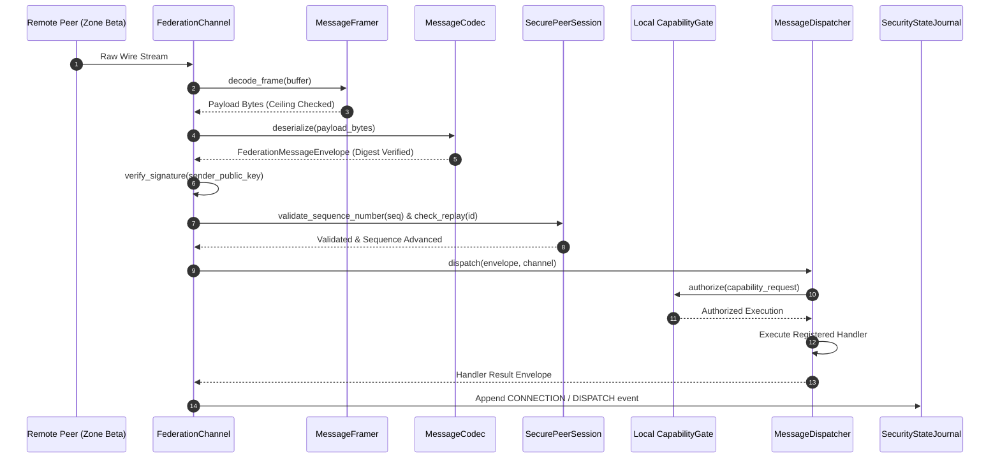
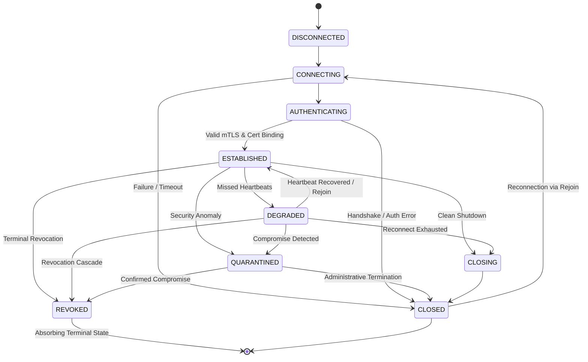

# CHAKRVIEW STEP 36 — FEDERATION MESSAGE TRANSPORT & SECURE INTER-NODE COMMUNICATION ARCHITECTURE

**Status**: RATIFIED & INTEGRATED  
**Baseline**: Step 35 Ratified (Commit: `53e1545`)  
**Implementation**: Step 36 Production Transport  
**Protocol Version**: 36.0  
**Neural Core Immutability**: Enforced ($\Delta W = 0$, Parameters: 3,443,136, Hash: `c5571c9c5cb7738625c885481ab2c026a00fa65dfb65e9761ef7eebb00a282da`)

---

## 1. End-to-End Transport Architecture

Step 36 implements production-grade inter-node communication, message framing, deterministic encoding, sequence-monotonic replay defense, and sovereign capability dispatch across distributed federation engines.

### Pipeline Hierarchy
```
DISCOVERY (Step 35)
   │
   ▼
MEMBERSHIP (Step 35)
   │
   ▼
mTLS CONNECTION (Step 31/35)
   │
   ▼
SECURE FEDERATION CHANNEL (Step 36)
   │
   ▼
AUTHENTICATED MESSAGE ENVELOPE (Canonical JSON + Ed25519)
   │
   ▼
REPLAY / SEQUENCE VALIDATION (Strict Monotonic Flooring)
   │
   ▼
LOCAL AUTHORIZATION (Sovereign CapabilityGate)
   │
   ▼
MESSAGE DISPATCH (Bounded Queue & Timeout Control)
   │
   ▼
AUDIT + DURABLE SECURITY JOURNAL (Append-Only WAL)
```

---

## 2. Federation Message Flow

The full message processing lifecycle operates in 9 discrete phases:



---

## 3. Channel Lifecycle State Machine

A `FederationChannel` adheres to strict fail-closed state transitions. The terminal states `REVOKED` and `CLOSED` cannot be bypassed.



### Transition Invariants
- `REVOKED` is an absorbing terminal state: A revoked channel can never transition back to `ACTIVE` or `ESTABLISHED`.
- Direct transition from `DISCONNECTED` to `ESTABLISHED` is strictly prohibited. Handshake and certificate binding authentication are mandatory.
- Quarantined channels block all transmission and reception fail-closed.

---

## 4. Binary Length-Prefixed Framing Specification

Network socket framing uses big-endian binary length prefixes:

```
+--------------------------+-------------------------------------------------+
| Frame Length (4 Bytes)   | Payload Bytes (Variable Length, UTF-8 JSON)     |
| Big-Endian uint32 (>I)   | Canonical Deterministic Envelope                |
+--------------------------+-------------------------------------------------+
```

### Framing Invariants:
1. **Pre-Allocation Ceiling Checks**: The 4-byte header is parsed before allocating memory buffers. If `length > DEFAULT_MAX_FRAME_SIZE` (1 MB), `OversizedFrameError` is raised immediately.
2. **Zero-Length Rejection**: If `length == 0`, `MalformedFrameError` is raised.
3. **Non-Destructive Truncation**: Incomplete frames leave unread bytes in the buffer and return `None` until sufficient data arrives.

---

## 5. Deterministic Canonical JSON Codec

`FederationMessageCodec` guarantees deterministic byte serialization across diverse CPU architectures and runtime versions:
- All keys are recursively sorted alphabetically (`sort_keys=True`).
- Separators are compact without extraneous whitespace (`separators=(',', ':')`).
- Encoded strictly in UTF-8.

### Prohibited Payload Scanner:
`_assert_no_prohibited_content()` recursively scans dictionaries and lists prior to serialization:
- **Prohibited Keywords**: `private_key`, `secret_key`, `session_secret`, `model_weights`, `weight_tensor`, `state_dict`, `pickle_data`, `__reduce__`, `__class__`.
- **Prohibited Data Types**: PyTorch tensors, executable callables, unpickled arbitrary Python objects, raw pointers.

---

## 6. Cryptographic Authentication & Envelope Signing

Every message envelope incorporates end-to-end cryptographic integrity:
1. **Deterministic SHA-256 Digest**: Computed over the canonical JSON representation of `envelope.payload`.
2. **Ed25519 Canonical Signing**: Computed over all metadata fields (`protocol_version`, `message_type`, `message_id`, `session_id`, `sender_engine_id`, `receiver_engine_id`, `sequence_number`, `epoch`, `timestamp`, `payload_digest`, `tenant_id`).
3. **Impostor Detection**: Tampered payloads or invalid signatures return `False` during verification and abort dispatch.

---

## 7. Sovereign Local Authorization via CapabilityGate

`LOCAL_AUTHORITY > PEER_AUTHORITY`: Remote peers cannot grant capabilities or authorize themselves.
- When a `CAPABILITY_REQUEST` envelope arrives, `FederationMessageDispatcher` converts the payload into a `CapabilityRequest` and routes it through the local `CapabilityGate.authorize()`.
- Missing scopes, expired tokens, or unassigned permissions fail closed with `UnauthorizedMessageError`.
- Tenant boundaries are verified against the local zone; cross-tenant execution is rejected.

---

## 8. Monotonic Sequence & Replay Protection

To defeat replay attacks and network packet reordering:
1. **Replay Cache**: `SecurePeerSession` maintains a cache of processed `message_id`s. Duplicate IDs raise `DuplicateMessageError`.
2. **Monotonic Sequence Enforcement**: Every message on an established channel must satisfy:
   $$\text{sequence\_number} > \text{last\_seen\_sequence\_number}$$
3. Regressive, duplicate, or backwards sequence numbers raise `SequenceRegressionError`.

---

## 9. Dispatcher Architecture & Timeout Control

`FederationMessageDispatcher` coordinates message handling:
- **Thread-Safe Handler Registry**: Handlers are registered per `FederationMessageType`.
- **Strict Error Containment**: Any exception occurring within a handler is caught and wrapped in `HandlerExecutionError`, preventing process-level crashes.
- **Timeout Bounds**: Handlers execute under bounded timeout ceilings (`default_timeout_seconds = 5.0`).

---

## 10. Periodic Heartbeat & Failure Detection

- `FederationChannel.send_heartbeat()` exchanges `HEARTBEAT` and `HEARTBEAT_ACK` envelopes to verify connection liveness.
- If no heartbeat is received within `timeout_seconds`, the channel transitions to `ChannelState.DEGRADED`.
- `UNREACHABLE != REVOKED`: Degradation records network impairment without revoking peer credentials.

---

## 11. Bounded Reconnect & Step 35 Secure Rejoin

When transport connectivity is interrupted:
- `ReconnectPolicy` controls reconnection attempts using exponential backoff:
  $$\text{backoff\_delay} = \min(\text{initial\_backoff} \times \text{multiplier}^{\text{attempt}-1}, \text{max\_backoff})$$
- Default settings: `initial_backoff = 0.5s`, `multiplier = 2.0`, `max_backoff = 30.0s`, `max_attempts = 5`.
- Reconnection re-invokes the Step 35 secure rejoin handshake (`reconnect_member`), re-verifying certificates and membership status without authority escalation.

---

## 12. Terminal Revocation Cascade & Quarantine

- Revocation of a node, certificate, or trust grant triggers an immediate cascade through `FederationChannel.revoke()`.
- Revoked channels reject all message traffic fail-closed (`ChannelRevokedError`).
- Quarantined channels block all operational message routing (`ChannelQuarantinedError`).

---

## 13. Durable Write-Ahead Journal Integration & Crash Recovery

Transport mutations write append-only records to `SecurityStateJournal` and `SecurityStateStore`:
- Event types: `CONNECTION_ESTABLISHED`, `CONNECTION_CLOSED`, `CHANNEL_QUARANTINED`, `CHANNEL_REVOKED`, `MESSAGE_DISPATCHED`.
- Zero secrets or private keys are written to disk.
- Crash recovery sequentially replays journal entries and verifies hash continuity.

---

## 14. Performance Benchmark Results

Empirical results from 100 benchmark iterations on local architecture:

| Benchmark Operation | Mean Latency | P95 Latency | Throughput |
|---|---|---|---|
| **Frame Encode** | 0.0029 ms | 0.0044 ms | 348,553 ops/sec |
| **Frame Decode** | 0.0043 ms | 0.0049 ms | 231,535 ops/sec |
| **Envelope Encode** | 0.1122 ms | 0.1198 ms | 8,912 ops/sec |
| **Envelope Decode** | 0.0859 ms | 0.0921 ms | 11,646 ops/sec |
| **Signature Verification** | 0.1536 ms | 0.1595 ms | 6,510 ops/sec |
| **Message Dispatch** | 0.0209 ms | 0.0250 ms | 47,742 ops/sec |
| **Replay & Sequence Check** | 0.0234 ms | 0.0313 ms | 42,662 ops/sec |
| **Authenticated Roundtrip** | 0.2868 ms | 0.3893 ms | 3,486 ops/sec |
| **Connection Establishment**| 0.0579 ms | 0.0767 ms | 17,274 ops/sec |
| **Reconnect** | 0.0140 ms | 0.0160 ms | 71,618 ops/sec |
| **Complete Message Lifecycle** | 0.6279 ms | 0.6991 ms | 1,592.5 ops/sec |
| **Peak Memory Delta** | **3,504.95 KB** (~3.4 MB) | — | — |

---

## 15. Neural Core Immutability Verification

Throughout all test suites and benchmark execution:
- **Parameters**: 3,443,136
- **Vocabulary Size**: 4096
- **Context Length**: 512
- **Initial Weight SHA-256**: `c5571c9c5cb7738625c885481ab2c026a00fa65dfb65e9761ef7eebb00a282da`
- **Final Weight SHA-256**: `c5571c9c5cb7738625c885481ab2c026a00fa65dfb65e9761ef7eebb00a282da`
- **Gradient Drift ($\Delta W$)**: **0.0** (Strictly zero neural weight mutation).
