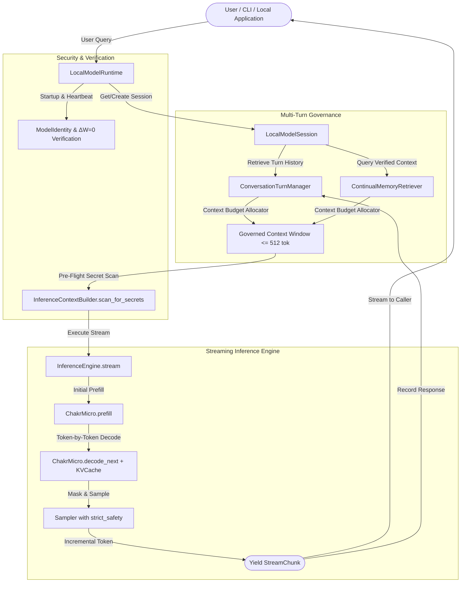

# STEP 46 — ARCHITECTURAL SPECIFICATION

## Local Model Runtime & Interactive Streaming Session Layer

**Date:** 2026-09-30  
**Phase:** Step 46 Architecture  
**Status:** Approved Architectural Specification  

---

## 1. Current State

ChakrView currently possesses:
- **Neural Core (`ChakrMicro v0.1`):** 3,443,136 parameters, 6 layers, 192 model dimension, 6 heads, 512 max context, 4,096 vocabulary, tied LM head (`chakrview/brain/`).
- **Tokenizer (`BPETokenizer`):** Trained 4,096 BPE tokenizer with serialization artifacts in `data/experiments/vocab_4096/`.
- **Inference Engine (`InferenceEngine`):** Fully ratified in Steps 44-45 (`chakrview/runtime/pipeline.py`), featuring `InferenceRequest`, `InferenceResult`, `ModelIdentity`, pre-flight contract verification, secret leakage detection, and stop token masking for `min_new_tokens`.
- **Sampling (`Sampler`):** Greedy, stochastic temperature, top-$k$, top-$p$, repetition penalty $[1.0, 10.0]$, and strict degenerate probability safety (`chakrview/runtime/sampling.py`).
- **Cognitive Memory & Retrieval:** `ContinualMemoryStorage`, `ContinualMemoryRetriever`, and `BM25KnowledgeIndex`.

However, the inference engine is strictly batch/blocking: callers invoke `execute(request)` and wait synchronously until the entire sequence of new tokens is generated before receiving an `InferenceResult`.

---

## 2. Identified Gap

The primary architectural gap between the current software foundation and a genuinely usable local model release is the **absence of a unified Local Model Runtime and Interactive Streaming Session Layer**:
1. **No Token Streaming:** Real-time client applications (interactive terminal sessions, local assistants, GUIs, or local agents) cannot stream tokens incrementally as they are decoded from the neural core.
2. **Legacy Disconnect in `InferenceSession`:** The Step 10 `InferenceSession` (`chakrview/runtime/inference.py`) bypassed all Step 44-45 contracts, secret scanners, tenant isolations, and model identity checks.
3. **No Governed Multi-Turn Context Windowing:** Interactive dialogues naturally exceed the 512-token context limit unless an automated, governed context manager slidingly manages token budgets across turn history, cognitive memory, and new completions.
4. **No Unified Local Entrypoint:** No single CLI/runner entrypoint exists for running the verified model locally with streaming text, memory recall, and full safety verification.

---

## 3. Why the Gap Matters

Without this layer:
- **Poor Latency Perception:** Generating 32 tokens at ~140 tok/s requires ~230 ms of dead silence before any text appears; streaming delivers the first token within ~50 ms and subsequent tokens incrementally.
- **Context Boundary Crashes:** In multi-turn dialogue, the 512-token ceiling causes crashes (`ContextOverflowError`) after 3-5 turns without governed compaction.
- **Architectural Fragmentation:** Developers might inadvertently use the unhardened legacy `InferenceSession` rather than the secure Step 44-45 `InferenceEngine`.

---

## 4. Existing Components to Reuse

Step 46 reuses existing components with zero duplication:
- **`InferenceEngine` (`chakrview/runtime/pipeline.py`):** Acts as the foundational execution engine.
- **`BPETokenizer` (`chakrview/tokenizer/tokenizer.py`):** Token encoding and streaming decoding.
- **`ChakrMicro` (`chakrview/brain/model.py`):** Unmodified neural core ($\Delta W = 0$).
- **`KVCache` (`chakrview/brain/cache.py`):** Step-by-step key-value cache.
- **`Sampler` (`chakrview/runtime/sampling.py`):** Step-by-step logit filtering and token selection.
- **`InferenceContextBuilder` (`chakrview/runtime/pipeline.py`):** Secret scanning and tenant boundary validation.
- **`ContinualMemoryRetriever` (`chakrview/cognition/federation/cognitive/memory_adapter.py`):** Conversational context recall.

---

## 5. Proposed Integration Architecture

### Core Architectural Additions:

1. **`InferenceEngine.stream()` (`chakrview/runtime/pipeline.py`):**
   - Yields `StreamChunk` objects in real-time as each token is generated.
   - Respects `min_new_tokens` stop token masking and `SamplingConfig`.
   - Guaranteed cleanup in `try...finally` blocks.
2. **`StreamChunk` Contract (`chakrview/runtime/pipeline.py`):**
   - `token_id: int`
   - `token_text: str`
   - `step_index: int`
   - `is_final: bool`
   - `stop_reason: Optional[StopReason]`
   - `latency_ms: float`
3. **`ConversationTurnManager` & `LocalModelSession` (`chakrview/runtime/session.py`):**
   - Tracks structured turns (`role="user" | "assistant" | "system"`).
   - Computes token allocations across history, memory context, and completion horizon.
   - Automatically slides oldest non-pinned turns out of context window while retaining essential context.
4. **`LocalModelRuntime` (`chakrview/runtime/local_runtime.py`):**
   - High-level coordinator managing `InferenceEngine`, tokenizer, sessions, and memory adapters.
   - Enforces pre-flight $\Delta W = 0$ validation against canonical hash.
   - Provides clean APIs: `runtime.chat()`, `runtime.stream_chat()`, `runtime.generate()`, `runtime.stream_generate()`.
5. **Interactive Local CLI Script (`scripts/run_local_model.py`):**
   - Terminal REPL for interacting with the local model with live streaming output.

---

## 6. Data Flow & Sequence

1. **Invocation:** Client calls `runtime.stream_chat(session_id="s1", prompt="Hello", config=...)`.
2. **Session Context Assembly:** `LocalModelSession` retrieves turn history, queries `ContinualMemoryRetriever` for relevant verified memory items, and builds the prompt text.
3. **Token Budget Verification:** `ConversationTurnManager` counts prompt + history tokens. If context $> 512 - \text{max\_new\_tokens}$, oldest turns are compacted.
4. **Secret Scanning:** `InferenceContextBuilder.scan_for_secrets()` verifies clean input.
5. **Prefill & Decode:** `InferenceEngine.stream()` executes parallel prefill, initializes `KVCache`, and enters the incremental decoding loop.
6. **Streaming Emission:** At each step, next token is sampled with numerical safety, decoded to UTF-8 text, and yielded to caller as `StreamChunk`.
7. **Turn Appending:** Upon stream completion, the user prompt and complete assistant output are recorded as a completed `ConversationTurn` in session history.

---

## 7. Security Boundaries & Failure Handling

- **Fail-Closed Secret Scan:** If user prompt contains credentials, `SecretLeakageInContextError` is raised before any tokens are processed.
- **Fail-Closed Context Overflow:** If a single turn prompt exceeds context capacity ($> 512 - \text{max\_new\_tokens}$) and `truncate_if_overflow=False`, `ContextOverflowError` is raised.
- **Weight Mutation Guard:** Any change to neural parameters triggers `NeuralWeightMutationError` immediately.
- **Exception Containment in Streaming:** Generator cleanup guarantees KV cache is reset even if consumer throws an exception or breaks early.

---

## 8. CPU & Resource Constraints

- **Single-Core / Multi-Thread CPU Budget:** Standard workstation execution with bounded thread counts (`torch.set_num_threads`).
- **Memory Overhead:** Total process memory remains $< 350\text{ MB}$ RSS.
- **KV Cache Allocation:** Fixed ceiling of 512 tokens ($6 \text{ layers} \times 2 \times 6 \text{ heads} \times 512 \text{ seq} \times 32 \text{ head\_dim} \times 4 \text{ bytes} \approx 4.7\text{ MB}$).

---

## 9. Explicit Non-Scope

- **No Training or Fine-Tuning ($\Delta W = 0$).**
- **No Changes to Model Architecture or Weights.**
- **No External Cloud API Connectors.**
- **No Asynchronous Web Server Frameworks (FastAPI/Tornado).**
