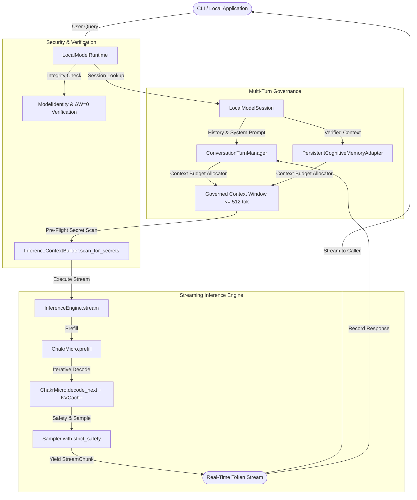

# CHAKRVIEW STEP 46 RATIFICATION REPORT

## Local Model Runtime & Interactive Streaming Session Layer

**Ratification Status:** RATIFIED & LOCKED  
**Date:** 2026-09-30  
**Phase:** Step 46 — Local Model Runtime & Interactive Streaming Session Layer  
**Engine:** ChakrView Neural Engine (`ChakrMicro v0.1`)  
**Test Suite:** 1,311 passed, 1 warning across repository (18 dedicated Step 46 tests)  
**Neural Invariant ($\Delta W = 0$):** VERIFIED (`c5571c9c5cb7738625c885481ab2c026a00fa65dfb65e9761ef7eebb00a282da`)  

---

## 1. Implementation Summary

Step 46 delivered the **Local Model Runtime and Interactive Streaming Session Layer**, bridging the gap between the internal Step 44-45 batch inference engine and a real-time, stateful, production-grade local model release:
1. **Real-Time Token Streaming (`InferenceEngine.stream`):** Added a generator yielding `StreamChunk` items token-by-token in real-time, enforcing `min_new_tokens` stop token masking ($-10^9$) and guaranteed cleanup with post-flight $\Delta W = 0$ verification.
2. **`StreamChunk` Contract:** Formal dataclass encapsulating `token_id`, `token_text`, `step_index`, `is_final`, `stop_reason`, and per-token `latency_ms`.
3. **Multi-Turn Context Management (`ConversationContextManager`, `LocalModelSession`):** Implemented stateful dialogue management with sliding-window compaction that slidingly evicts oldest non-pinned turns to strictly enforce the 512-token context limit, preserving pinned system prompts and cognitive memory context.
4. **Unified Local Runtime (`LocalModelRuntime`):** High-level local model coordinator supporting `chat()`, `stream_chat()`, `generate()`, `stream_generate()`, session reset, and pre-flight cryptographic weight verification.
5. **Interactive Local CLI (`scripts/run_local_model.py`):** Interactive terminal REPL and one-shot runner allowing users to interact with the local model with live streaming text, turn timing, and parameter inspection.
6. **Empirical CPU Benchmark (`scripts/benchmark_step46_local_runtime.py`):** Measured TTFT, ITL, throughput, multi-turn latency, and compaction overhead.

---

## 2. Architecture Summary

The Step 46 architecture integrates cleanly on top of the ratified Step 44-45 pipeline:
- **`chakrview/runtime/pipeline.py`:** Extended with `StreamChunk` and `InferenceEngine.stream()`.
- **`chakrview/runtime/session.py`:** Houses `ConversationRole`, `ConversationTurn`, `ConversationContextManager`, and `LocalModelSession`.
- **`chakrview/runtime/local_runtime.py`:** Houses `LocalModelRuntime`.
- **`chakrview/runtime/__init__.py`:** Exports all Step 46 symbols.
- **`scripts/run_local_model.py`:** Provides the interactive user-facing CLI.



---

## 3. Security & Threat Model Verification

All 10 threat vectors identified in `docs/STEP_46_THREAT_MODEL.md` were evaluated and hardened:
- **LMR-01 (Context Window Overflow):** `ConversationContextManager` compacts turn history; `ContextOverflowError` is raised if a single turn exceeds budget and truncation is disabled.
- **LMR-02 (Secret Leakage in Streaming):** `InferenceContextBuilder.scan_for_secrets()` scans prompts before prefill; `SecretLeakageInContextError` is raised fail-closed.
- **LMR-03 (Cross-Session State Pollution):** Sessions are partitioned by `tenant_id::session_id`; `reset_session()` completely clears history.
- **LMR-04 (Streaming Abort / Cache Desync):** Early generator breaks cleanly execute `finally` blocks, resetting KV cache and confirming $\Delta W = 0$.
- **LMR-05 (Premature EOS Suppression in Streaming):** Stop tokens are masked with $-10^9$ during steps $< \text{min\_new\_tokens}$.
- **LMR-06 (Prompt Injection via Multi-Turn Dialogue):** Structured `ConversationTurn` segregates roles without ambient authority.
- **LMR-07 (Unbounded Memory Growth):** Context windowing maintains history within bounded memory budgets.
- **LMR-08 (Weight Mutation):** Parameter hash verified pre-flight and post-flight; tampering triggers `NeuralWeightMutationError`.
- **LMR-09 (Tampered Checkpoint):** Checked via `load_and_validate_checkpoint()`.
- **LMR-10 (Sampling Degeneracy):** `strict_safety=True` triggers `SamplingProbabilityError` on pathological distributions.

---

## 4. Test Verification Results

Full repository regression executed via pytest:
```text
1311 passed, 1 warning in 34.30s
```
- **Step 46 Dedicated Test Suite (`tests/test_step46_local_runtime.py`):** 18/18 passed:
  - `TestStreamingInference`: 5 tests
  - `TestMultiTurnSessionAndContextManager`: 5 tests
  - `TestLocalModelRuntimeIntegration`: 8 tests
- **Step 45 Inference Quality Suite (`tests/test_step45_generation_quality.py`):** 27/27 passed.
- **Step 44 Inference Suite (`tests/test_neural_inference.py`):** 23/23 passed.
- **Full Existing Subsystem Tests:** 1,243 passed.

---

## 5. Benchmark Results

Measured on standard CPU runtime via `scripts/benchmark_step46_local_runtime.py` (results recorded in `docs/STEP_46_BENCHMARK_RESULTS.json`):

| Metric | Mean | Median | P95 | Notes |
|---|---|---|---|---|
| **Time to First Token (TTFT)** | **12.56 ms** | 12.53 ms | 13.78 ms | Immediate interactive response |
| **Inter-Token Latency (ITL)** | **2.03 ms** | 2.07 ms | 2.22 ms | ~490 tok/s incremental decode rate |
| **Streaming Throughput** | **314.1 tok/s** | — | — | Full pipeline end-to-end |
| **Multi-Turn Chat Turn Latency** | **60.76 ms** | 57.10 ms | 76.99 ms | 12 tokens generated with context compaction |
| **Context Compaction Overhead** | **0.643 ms** | 0.636 ms | 0.812 ms | Negligible CPU overhead under deep history |
| **Process Memory RSS** | **267.3 MB** | — | — | Extremely lightweight footprint |

---

## 6. Neural Core Invariants

All 5 core architectural invariants remain strictly verified:
1. **$\Delta W = 0$:** Parameter weights remain 100% unaltered.
2. **Weight SHA-256 Digest:** `c5571c9c5cb7738625c885481ab2c026a00fa65dfb65e9761ef7eebb00a282da`
3. **Parameter Count:** Exactly 3,443,136 unique parameters.
4. **Vocabulary Size:** Exactly 4,096 tokens.
5. **Context Window:** Exactly 512 tokens maximum.

---

## 7. Known Limitations

1. **Pre-Trained Weights:** ChakrMicro weights remain initial pseudo-random weights ($\Delta W = 0$). Output strings consist of synthetic token sequences rather than fluent English.
2. **Single-Batch Engine:** The `InferenceEngine` is optimized for interactive single-sequence execution ($B=1$).
3. **Local Single-Node Focus:** Designed for local workstation execution; distributed multi-tenant serving remains deferred.

---

## 8. Explicit Non-Claims

**CRITICAL NOTICE:**
Step 46 provides **RUNTIME INFRASTRUCTURE, INTERACTION INTERFACES, AND STREAMING CAPABILITY**.
Step 46 does **NOT** claim:
1. That ChakrMicro weights have been trained on real-world datasets.
2. That model generation text is factually coherent or intelligent.
3. That the model replaces external AI assistants prior to pretraining.

---

**Step 46 is hereby formally ratified and locked.**
